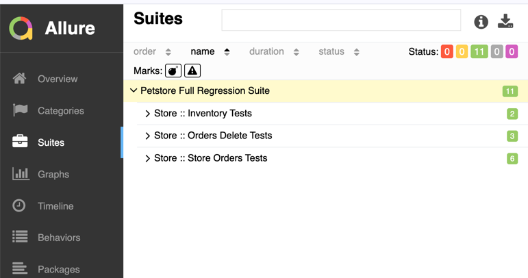

# Petstore API Test Automation Framework

Welcome to the **Petstore API Test Automation Framework**, a scalable, modular, and extensible solution built for testing the [Swagger Petstore Store API](https://petstore.swagger.io/). This framework is built using modern test tools and best practices to ensure API quality, CI compatibility, and QA productivity.

---

## ✨ Technologies Used

| Tool                | Purpose                              |
|---------------------|--------------------------------------|
| **Java 11**         | Base programming language            |
| **TestNG**          | Test framework for organizing and running tests |
| **Rest Assured**    | Fluent REST API test client          |
| **Maven**           | Build tool and dependency manager    |
| **Allure**          | Reporting engine for detailed, interactive test reports |
| **Lombok**          | Reduces boilerplate code (e.g. builders, getters) |
| **Log4j2**          | Logging utility                      |

---

## 📊 Framework Features

- ✅ Modular test classes by endpoint: `StoreInventoryTests`, `StoreOrderTests`, `StoreOrderDeletionTests`
- ✅ Positive and negative tests per endpoint with dynamic data generation
- ✅ Parallel execution support via TestNG thread settings
- ✅ Clear grouping via TestNG suites and Allure annotations
- ✅ Clean and extensible project structure for future APIs
- ✅ Allure reports with metadata
- ✅ Logging of requests, responses, and important actions

---

## 🔄 Project Structure

```
petstore-api-tests/
├── src/test/java
│   └── org/example/petstore/tests
│       ├── StoreInventoryTests.java
│       ├── StoreOrderTests.java
│       ├── StoreOrderDeletionTests.java
│
├── src/test/resources
│   ├── allure.properties               # Allure config (results dir)
│   └── testng.xml                      # TestNG suite config
│
├── target/
│   ├── allure-results/                 # Raw test execution results
│   └── site/allure-maven-plugin/       # Generated HTML report
│
├── pom.xml                             # Maven project configuration
└── README.md
```

---

## 🎮 How to Run Tests

### Run All Tests:
```bash
mvn clean test -DsuiteXmlFile=src/test/resources/testng.xml
```

### Run Specific Suite or Class:
Modify `testng.xml` to only include specific classes or tests.

### Run with Custom Thread Count:
```bash
mvn test -DsuiteXmlFile=src/test/resources/testng.xml -Ddataproviderthreadcount=4
```
In `testng.xml`:
```xml
<suite name="Petstore Suite" parallel="classes" thread-count="4">
```

### Run Tests by Group:
```bash
mvn test -Dgroups="store"
```
Use `@Test(groups = {"store", "order"})` annotations to assign tests to groups.

---

## 🌐 Allure Reporting

### ✅ Generate Report to Static HTML:
```bash
mvn allure:report
```
Open the generated HTML:
```bash
open target/site/allure-maven-plugin/index.html   # macOS
# or
xdg-open target/site/allure-maven-plugin/index.html  # Linux
```

### ☕ Serve Report as Local Web Server:
```bash
mvn allure:serve
```
This opens a browser with the report served on `http://localhost:port`

> Note: Make sure your test run generated results to `target/allure-results`.

---

## ⚖️ Extension Points

| Area                    | How to Extend                                                   |
|-------------------------|------------------------------------------------------------------|
| New API Tests           | Create new test class in `org.example.petstore.tests.*`          |
| Dynamic Data            | Add to `TestDataHelper` or use Lombok builders with random data |
| CI Integration          | Hook into Jenkins/GitHub Actions, trigger with Maven goals      |
| Environment Support     | Add profiles and `env.properties` with URL/auth switching       |
| Logging                 | Enhance or configure `log4j2.xml` as needed                    |

---

## 🌟 Future Improvements

- [ ] Add schema validation for API responses (e.g. JSON Schema Validator)
- [ ] Integrate performance tests with JMeter or Gatling
- [ ] Add environment-based test data injection
- [ ] Dockerized local test execution environment
- [ ] Publish Allure report as GitHub Pages or artifact

---

## 🚀 Quick Start
```bash
# Clone the repo
git clone https://github.com/where-it-stored/petstore-api-tests.git
cd petstore-api-tests

# Run all tests
mvn clean test -DsuiteXmlFile=src/test/resources/testng.xml

# Generate report
mvn allure:report
open target/site/allure-maven-plugin/index.html


```
